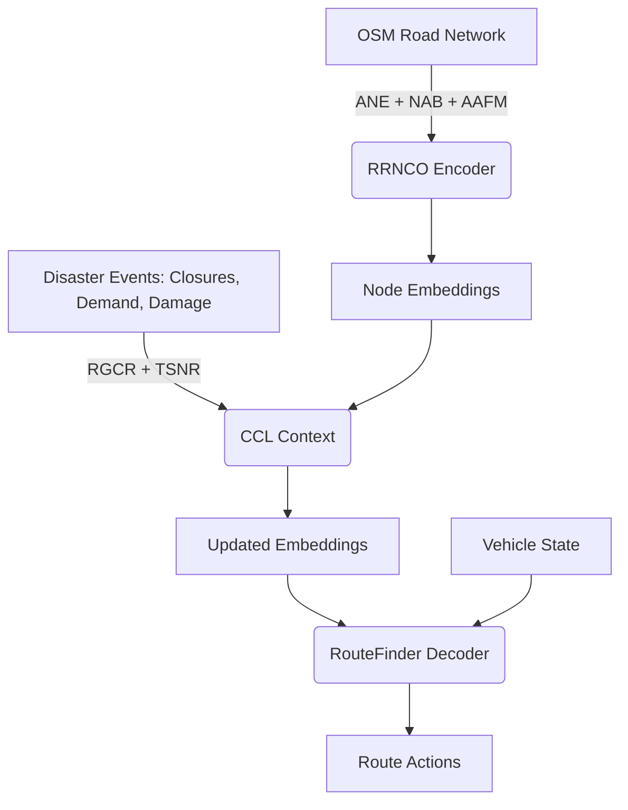

# DANA: Disaster-Aware Neural Algorithm

DANA is a pure neural network combinatorial optimization (NCO) framework designed specifically for humanitarian logistics routing. It targets the Multi-Depot Vehicle Routing Problem with Time Windows (MDVRPTW) in dynamic disaster response scenarios. 

Unlike traditional operations research solvers or heuristic methods (e.g., GA, ACO) which struggle to adapt in real-time, DANA relies entirely on Reinforcement Learning to evaluate and optimize routes dynamically as the environment changes.

## Architecture

DANA's architecture integrates three main components to bridge the gap between static algorithmic routing and real-world disaster management:

1. **RRNCO Encoder (OSM Road Network)**
   DANA is the first integration of the RRNCO (Real Road Neural Combinatorial Optimization) road network encoder. Instead of training on Euclidean distances (which fail on real road networks), the encoder leverages real-world asymmetric road data from OpenStreetMap. 
   - Uses *ANE* (Asymmetric Network Embeddings), *NAB* (Network Attention Blocks), and *AAFM* (Asymmetric Attention Fusion Modules) to generate embeddings for network nodes based on actual travel times and distances.

2. **CCL Context (Disaster Events)**
   To handle the dynamic nature of disaster zones, DANA uses CCL (Continuous Context Learning) modules: *RGCR* (Robust Graph Context Representation) and *TSNR* (Time-Series Node Representation).
   - This part of the network ingests live disaster events such as road closures, new emerging demands, and depot damage, updating the node embeddings dynamically in response to these shocks.

3. **RouteFinder Decoder (Policy Generation)**
   Based on the context-aware embeddings, the vehicle state is fed into a RouteFinder decoder. This attention-based policy network autoregressively predicts the optimal sequence of delivery actions.

## What's New in DANA?

DANA is a novel approach compared to existing works, focusing entirely on humanitarian priorities over commercial cost-cutting. Key contributions include:

- **Pure Neural Model**: It operates fully in PyTorch without relying on heuristic meta-solvers, OR frameworks (like OR-Tools), or external dependencies, granting full NCO flexibility.
- **Humanitarian Reward Function**: Instead of aiming solely for the shortest distance, DANA is trained with a specialized reward function derived from Chapter 14 of the VRP literature. It balances **Response Time**, **Satisfaction**, and **Equity** while heavily penalizing constraints violations. 
- **Dynamic Real-World Application**: While most modern NCO methods are trained on synthetic Euclidean maps, DANA is applied directly to real-world GIS road networks (including a dedicated Cairo/Nile Delta disaster benchmark) with dynamic interruptions.
- **POMO + REINFORCE**: Trained using the POMO baseline approach with the REINFORCE algorithm to ensure stability and robust convergence over large routing instances.
